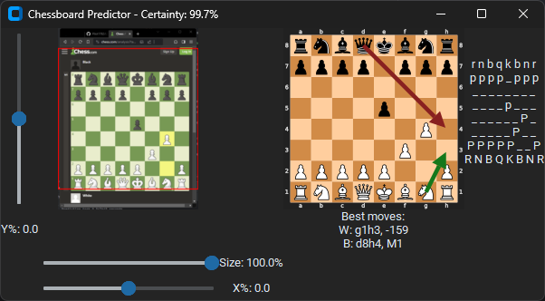

TensorFlow Chessbot - /u/ChessFenBot [◕ _ ◕]<sup>\* *I make FENs*</sup>
---
## Command Line Interface (CLI)

### Setting up the virtual environment

This uses Python 3, pip3, and virtualenv. If you don't have these installed, you can use:

```
sudo apt-get install python3-pip
sudo pip3 install virtualenv
```

Then, create a new virtual environment, source it, and install the dependencies from `requirements.txt`.

```
virtualenv venv
source venv/bin/activate
pip3 install -r requirements.txt 
```

### Running the CLI

`tensorflow_chessbot.py` contains the library and script for running predictions on images passed by file or url.

```
$ ./tensorflow_chessbot.py -h
usage: tensorflow_chessbot.py [-h] [--url URL] [--filepath FILEPATH]
 
 Predict a chessboard FEN from supplied local image link or URL
 
 optional arguments:
   -h, --help           show this help message and exit
   --url URL            URL of image (ex. https://imgur.com/u4zF5Hj.png)
  --filepath FILEPATH  filepath to image (ex. u4zF5Hj.png)
```

For example, to run on the provided `example_input.png` 

```
./tensorflow_chessbot.py --filepath example_input.png
```

Should output something like:

```
(venv) $ ./tensorflow_chessbot.py --filepath example_input.png

--- Prediction on file example_input.png ---
   Loading model 'saved_models/frozen_model.pb'
   Model restored.
Closing session.
Per-tile certainty:
[[1. 1. 1. 1. 1. 1. 1. 1.]
 [1. 1. 1. 1. 1. 1. 1. 1.]
 [1. 1. 1. 1. 1. 1. 1. 1.]
 [1. 1. 1. 1. 1. 1. 1. 1.]
 [1. 1. 1. 1. 1. 1. 1. 1.]
 [1. 1. 1. 1. 1. 1. 1. 1.]
 [1. 1. 1. 1. 1. 1. 1. 1.]
 [1. 1. 1. 1. 1. 1. 1. 1.]]
Certainty range [0.999975 - 1], Avg: 0.999997
---
Predicted FEN: bn4kN/p5bp/1p3npB/3p4/8/5Q2/PPP2PPP/R3R1K1
Final Certainty: 100.0%
```

Which would be


## Live Streaming

The live-streaming script `live.py` will spawn a GUI after you select the window for it to watch.
Only one window is used as apposed to the entire screen to reduce the amount of processing required.



### Controls

The `Y%` slider controls the percent shift up or down, being 100% the top and -100% is the bottom.

The `X%` slider controls the percent shift left or right, being 100% the right and -100% is the left.

The `Size` slider controls the size of the square to be cropped, being 100% the entire square and 0% is nothing.

### Reading the UI

The left image is the raw image with the red square being where the cropped image is taken from.

The right image is the cropped image if a chessboard is not detected otherwise it is a representation of the board.
Any green arrow represents the best move for white, and any red arrow represents the best move for black.
The red square is the attacker if you are in check.
The yellow squares are the other pieces attacked by the attacker.

The far right is a textual representation of the board,
with the capital letters being white and the lowercase letters being black.

Under the right image is the best move for white and black, along with their respective evaluation.

The title shows the certainty of the board positions.
